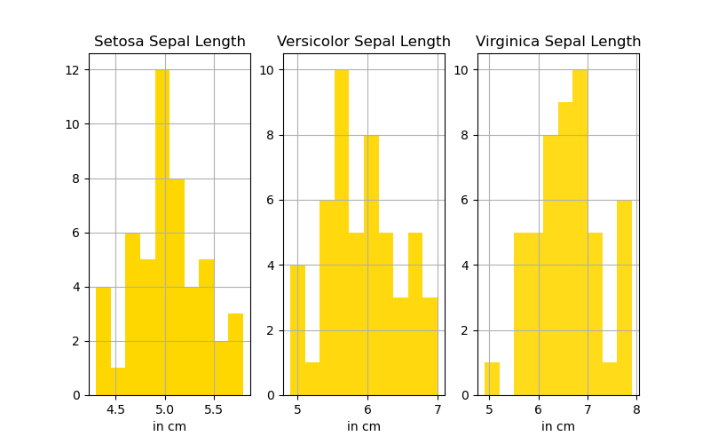

# Fisher Iris Dataset

## Introduction

The data set I analysed was the Fisher Iris data set. I used the data set to create histograms and scatter plots in order to gain insights into the characteristics of different iris species. 

The Fisher Iris data set centres around three species; Setosa, Versicolor and Virginica, from which 50 samples were taken each. Four measurements were taken from two places, the sepal (length and width) and the petals (length and width). 

At the time of the dataset being created, statistician and biologist, Ronald Fisher used the data to develop a way to differentiate the species by their characteristics, creating a linear discriminant analysis.

Sepals are characterised as laying flat and are the "landing pads" for bees and other insects, whilst the petals stand straight upwards.

## Repository

The repository contains four files and a directory:
1. #### README.md:
    
    1. 
        Background and overview
    2. 
        A breakdown of the process of creating the script for analysis.py
    3. 
        Instructions for using the code 
    4. 
        References

2. #### analysis.py
    
    Contains the script used to analyse the data.

3. #### iris.csv
    
    Is the source of the dataset used.

4. #### summary_statistics.txt
    
    Contains the mean, standard deviation and the minimum and maximum values of each variable in the data set.

5. #### My-plots
    
    Is the directory containing all plots generated using analysis.py.

## Analysis.py

To run the code, the user will need to have Python available to use on their computer, which can be downloaded from the [official website](https://www.python.org/downloads/release/python-3123/). The raw script (analysis.py) can be cloned and downloaded from Github. Afterwards, the user will need to open a terminal and navigate to the directory that contains the raw code. From there the user can run the code by typing in the following command: python analysis.py. 

Firstly to begin writing my Python code, I had to download the [Fisher Iris dataset](https://gist.github.com/curran/a08a1080b88344b0c8a7) and save it as a csv file within my repository to use the data for analysis. 

Secondly I had to import all relevant libraries as follows: pandas, os and matplotlib.py. 

Then I could create my variables, for example “iris”, “setosa”, “versicolor” and “virginica”. With the variable “iris”, I could create a subplot of histograms to give an overview of each variable (sepal length and width, and petal length and width). Subplots of histograms to compare sepal length, sepal width, petal length and petal width between the three species are also created. Two scatter plots are created to show the correlation between each pair of variables, however all species are included. 

And finally I created a directory in order to store the plots. 

## Data Analysis and Plots

### Petal Length

- Setosa petal length data is roughly symmetric with little variation in length (less than 1cm). They have the shortest petals of all three species.

- Versicolor petal length data is skewed left with the majority of lengths about 4.5cm. Variation in petal length is relatively moderate, with about 2cm difference in the min and max range.

- Virginica petal length data is skewed right and the variation in length is the greatest of the three (at about 2.7cm in difference). And Virginica have the longest petals. 

### Petal Width

- Setosa petal widths are the thinnest of the three species and there is very little variation in their measurements, with over half of the measurements being roughly 0.25cm. There are however some outliers with the range sitting between 0.1 and 0.6cm.

- Versicolor petals are wider than Setosa petals and range between approx. 1 and 1.85cm in width. There's a slight skew to the right with the majority measuring between 1 and 1.3cm.

- Vriginica petals are the widest of the three and have the most variation. With the majority being at the wider end of the range.

### Sepal Length

- Setosa sepal lengths are roughly symmetrical with an approximate range of 4.2 and 5.8cm.

- Versicolor sepal lengths are skewed to the right. With a min and max of 4.9 and 7cm.

- Vriginica tend to have the longest sepals with a left skewed data set and most measurements being between 6 and 7cm. The min and max are about 4.9 and 7.9. Once again showing Virginicas to have the longest and most varying measurements of the three species.

### Sepal Width

- Surprisingly, Setosa have the widest sepals and the most variance. The range is between approx. 2.1 and 4.4cm.

- Versicolors are skewed left with a min and max of 2 and 3.4cm.

- Virginica are roughly symmetrical. The range of Virginica sepal widths is between 2.1 and 3.9cm

### Petal Scatter

- Setosa are clearly separate from the other species in the lower left corner, having the thinnest and shortest petals of the three species.

- Versicolor Irises lie in the middle of the scatter plot. The length and width of both Versicolor and Setosa petals have a positive relationship.

- Virginica Irises with their long and wide petals can clearly be seen in the upper right of the scatter plot. Both variables have a positive relationship, but the greater variance in measurements, relative to Setosa and Versicolor, can also be seen here.

### Sepal Scatter

- There doesn't appear to be any relationship between the length and width of the sepals.

- We can see outliers in sepal widths, between 4 and 5cm, we know these belong to Setosa. Whilst the longest sepals between 7.5 and 8cm belong to Virginica. Once again, Versicolor tend to gather in the middle, between the two species.

## Conclusion

In conclusion, there is certainly a clear difference between Setosa and Virginica. Setosa consistently has the smallest petal measurements, which can explain the outliers in the Petal length and Petal Width histograms above. At the same time Setosa have the widest sepals.

Virginica have the largest petals in both length and width and the longest sepals. The only exception being sepal widths.

Versicolor sits firmly in the middle, but tends to be closer in lengths and widths to Virginica than Setosa. Likewise, Versicolor appears to align itself with the median values of each variable. 

## References

Where I download the iris dataset:
https://gist.github.com/curran/a08a1080b88344b0c8a7

Python download:
https://www.python.org/downloads/release/python-3123/

Matplotlib from CSV file: 
https://www.tutorialspoint.com/plot-data-from-csv-file-with-matplotlib

How to create the various plots (histogram and scatter plots):
https://pandas.pydata.org/docs/getting_started/intro_tutorials/04_plotting.html

Save a histogram to a png file:
https://www.tutorialspoint.com/how-to-save-a-histogram-plot-in-python

Overlapping problem:
https://matplotlib.org/stable/users/explain/axes/tight_layout_guide.html

Improving code readability:
https://realpython.com/python-pep8/#:~:text=PEP%208%2C%20sometimes%20spelled%20PEP8,and%20consistency%20of%20Python%20code.

Import os:
https://docs.python.org/3/library/os.html
https://www.geeksforgeeks.org/os-module-python-examples/

How to use markdown (cheat sheet and basic syntax):
https://www.markdownguide.org/basic-syntax/

Public domain iris images:
https://www.backyardnature.net/
https://www.fs.usda.gov/wildflowers/beauty/iris/flower.shtml